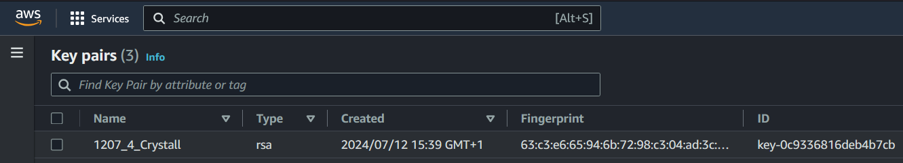
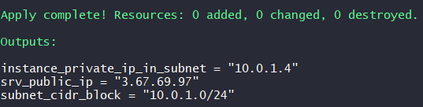
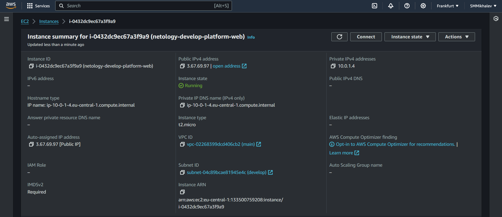
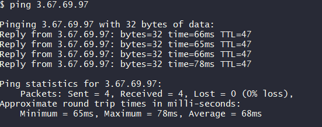
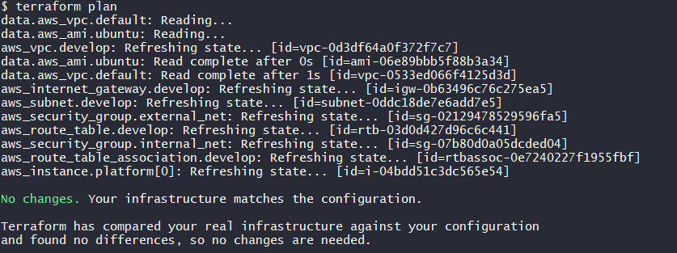

# Домашнее задание к занятию «Основы Terraform. Yandex Cloud» - Михалёв Сергей

### Задание 0

1. Ознакомьтесь с [документацией к security-groups в Yandex Cloud](https://cloud.yandex.ru/docs/vpc/concepts/security-groups?from=int-console-help-center-or-nav). 
Этот функционал понадобится к следующей лекции.

---

**Решение**

Так как геополитическая ситуация в мире нестабильна, данное домашнее задание выполнено на платформе Amazon AWS.

<image src="https://encrypted-tbn0.gstatic.com/images?q=tbn:ANd9GcTJEZ8qzIPaSZbld6HkjbcGXg9Eb51DT5HN7aRZVQzPn2Myo93Onq7PXtWMglYnTnMqy3c&usqp=CAU)" alt="AWS"  width="100" height="auto">

------

### Задание 1
В качестве ответа всегда полностью прикладывайте ваш terraform-код в git.
Убедитесь что ваша версия **Terraform** ~>1.8.4

1. Изучите проект. В файле variables.tf объявлены переменные для Yandex provider.
2. Создайте сервисный аккаунт и ключ. [service_account_key_file](https://terraform-provider.yandexcloud.net).
4. Сгенерируйте новый или используйте свой текущий ssh-ключ. Запишите его открытую(public) часть в переменную **vms_ssh_public_root_key**.
5. Инициализируйте проект, выполните код. Исправьте намеренно допущенные синтаксические ошибки. Ищите внимательно, посимвольно. Ответьте, в чём заключается их суть.
6. Подключитесь к консоли ВМ через ssh и выполните команду ``` curl ifconfig.me```.
Примечание: К OS ubuntu "out of a box, те из коробки" необходимо подключаться под пользователем ubuntu: ```"ssh ubuntu@vm_ip_address"```. Предварительно убедитесь, что ваш ключ добавлен в ssh-агент: ```eval $(ssh-agent) && ssh-add``` Вы познакомитесь с тем как при создании ВМ создать своего пользователя в блоке metadata в следующей лекции.;
8. Ответьте, как в процессе обучения могут пригодиться параметры ```preemptible = true``` и ```core_fraction=5``` в параметрах ВМ.

В качестве решения приложите:

- скриншот ЛК Yandex Cloud с созданной ВМ, где видно внешний ip-адрес;
- скриншот консоли, curl должен отобразить тот же внешний ip-адрес;
- ответы на вопросы.

---
**Решение**

1. Изменил файл *providers.tf* под нужды aws:
```
    provider "aws" {
    region = var.region
    access_key = var.access_key
    secret_key = var.secret_key
    }
``` 
2. Создал *Key pair*</br>
   
   
4. Так как ключ был сгенерирован на AWS, то открытой части получить не удастся.
5. Предложенные в задании характеристики ВМ соответствуют инстансу *t2.micro* на Amazon. *boot_disk* аналогичен  *gp2*. Вместо *metadata* использовал *tags*.
6. Для разрешения портов доступа к ВМ использовал *security_group*.
7. Что бы уменьшить задержку в обновлении добавил
```
lifecycle {
    create_before_destroy = true
  }
```
8. Штатный подход AWS к формированию сетей заключается в использовании дефолной сети по умолчанию. При этом выдаётся некий дефолтный диаппазон адресов. Для выполнения задния в сети *10.0.1.0/24* пришлось создавать *gateway* с таблицей маршрутизации.
8. После запуска получаем инстанс с такими пораметрами:</br>
  </br>
  В сервисе EC2 AWS можно отследить параметры ВМ</br>
  </br>
  Публичный адрес при этом пингуется</br>
  </br>

  -----

  
### Задание 2

1. Замените все хардкод-**значения** для ресурсов **yandex_compute_image** и **yandex_compute_instance** на **отдельные** переменные. К названиям переменных ВМ добавьте в начало префикс **vm_web_** .  Пример: **vm_web_name**.
2. Объявите нужные переменные в файле variables.tf, обязательно указывайте тип переменной. Заполните их **default** прежними значениями из main.tf. 
3. Проверьте terraform plan. Изменений быть не должно.

**Решение**
1. В качестве борьбы с хардкором создал следующие переменные:
   - *vm_web_name*
   - *vm_web_instance_type*
   - *vm_web_volume_type*
   Так же решил "причесать" тэги:
   - *vm_web_owner*
   - *vm_web_project*
2. *terraform plan* никаких изменений не нашёл.</br>
   </br>

