# Домашнее задание к занятию «Основы Terraform. Yandex Cloud» - Михалёв Сергей

### Задание 0

1. Ознакомьтесь с [документацией к security-groups в Yandex Cloud](https://cloud.yandex.ru/docs/vpc/concepts/security-groups?from=int-console-help-center-or-nav). 
Этот функционал понадобится к следующей лекции.

---

**Решение**

Так как геополитическая ситуация в мире нестабильна, данное домашнее задание выполнено на платформе Amazon AWS.

<image src="https://encrypted-tbn0.gstatic.com/images?q=tbn:ANd9GcTJEZ8qzIPaSZbld6HkjbcGXg9Eb51DT5HN7aRZVQzPn2Myo93Onq7PXtWMglYnTnMqy3c&usqp=CAU)" alt="AWS"  width="100" height="auto">

------

### Задание 1
В качестве ответа всегда полностью прикладывайте ваш terraform-код в git.
Убедитесь что ваша версия **Terraform** ~>1.8.4

1. Изучите проект. В файле variables.tf объявлены переменные для Yandex provider.
2. Создайте сервисный аккаунт и ключ. [service_account_key_file](https://terraform-provider.yandexcloud.net).
4. Сгенерируйте новый или используйте свой текущий ssh-ключ. Запишите его открытую(public) часть в переменную **vms_ssh_public_root_key**.
5. Инициализируйте проект, выполните код. Исправьте намеренно допущенные синтаксические ошибки. Ищите внимательно, посимвольно. Ответьте, в чём заключается их суть.
6. Подключитесь к консоли ВМ через ssh и выполните команду ``` curl ifconfig.me```.
Примечание: К OS ubuntu "out of a box, те из коробки" необходимо подключаться под пользователем ubuntu: ```"ssh ubuntu@vm_ip_address"```. Предварительно убедитесь, что ваш ключ добавлен в ssh-агент: ```eval $(ssh-agent) && ssh-add``` Вы познакомитесь с тем как при создании ВМ создать своего пользователя в блоке metadata в следующей лекции.;
8. Ответьте, как в процессе обучения могут пригодиться параметры ```preemptible = true``` и ```core_fraction=5``` в параметрах ВМ.

В качестве решения приложите:

- скриншот ЛК Yandex Cloud с созданной ВМ, где видно внешний ip-адрес;
- скриншот консоли, curl должен отобразить тот же внешний ip-адрес;
- ответы на вопросы.

---
**Решение**

1. Изменил файл *providers.tf* под нужды aws:
```
    provider "aws" {
    region = var.region
    access_key = var.access_key
    secret_key = var.secret_key
    }
``` 
2. Создал *Key pair*</br>
   
   
4. Так как ключ был сгенерирован на AWS, то открытой части получить не удастся.
5. Предложенные в задании характеристики ВМ соответствуют инстансу *t2.micro* на Amazon. *boot_disk* аналогичен  *gp2*. Вместо *metadata* использовал *tags*.
6. Для разрешения портов доступа к ВМ использовал *security_group*.
7. Что бы уменьшить задержку в обновлении добавил
```
lifecycle {
    create_before_destroy = true
  }
```
8. Штатный подход AWS к формированию сетей заключается в использовании дефолной сети по умолчанию. При этом выдаётся некий дефолтный диаппазон адресов. Для выполнения задния в сети *10.0.1.0/24* пришлось создавать *gateway* с таблицей маршрутизации.
8. После запуска получаем инстанс с такими пораметрами:</br>
  </br>
  В сервисе EC2 AWS можно отследить параметры ВМ</br>
  </br>
  Публичный адрес при этом пингуется</br>
  </br>

  -----

  
### Задание 2

1. Замените все хардкод-**значения** для ресурсов **yandex_compute_image** и **yandex_compute_instance** на **отдельные** переменные. К названиям переменных ВМ добавьте в начало префикс **vm_web_** .  Пример: **vm_web_name**.
2. Объявите нужные переменные в файле variables.tf, обязательно указывайте тип переменной. Заполните их **default** прежними значениями из main.tf. 
3. Проверьте terraform plan. Изменений быть не должно.

---

**Решение**
1. В качестве борьбы с хардкором создал следующие переменные:
   - *vm_web_name*
   - *vm_web_instance_type*
   - *vm_web_volume_type*
   Так же решил "причесать" тэги:
   - *vm_web_owner*
   - *vm_web_project*
2. *terraform plan* никаких изменений не нашёл.</br>
   </br>

-----

### Задание 3

1. Создайте в корне проекта файл 'vms_platform.tf' . Перенесите в него все переменные первой ВМ.
2. Скопируйте блок ресурса и создайте с его помощью вторую ВМ в файле main.tf: **"netology-develop-platform-db"** ,  ```cores  = 2, memory = 2, core_fraction = 20```. Объявите её переменные с префиксом **vm_db_** в том же файле ('vms_platform.tf').  ВМ должна работать в зоне "ru-central1-b"
3. Примените изменения.

---

**Решение**
1. С точки зрения удобства привык прибегать к декомпозиции кода. Здесь вынес сетевыет настройки в [*subnet.tf*](subnet.tf) и поиск последней версии ami Ubuntu в *data.tf*.
2. В AWS EC2 нет прямого аналога параметру *core_fraction*, однако T-серия экземпляров (например, t3 или t4g) предоставляет подобную функциональность через механизм кредитов производительности: T-серия: Эти экземпляры обеспечивают базовый уровень производительности, подходящий для приложений с переменной или низкой интенсивностью использования процессора. Они накапливают кредиты производительности, которые могут быть использованы для всплесков активности, когда требуется более высокая производительность. Наиболее подходящим под характеристики является *t3.small* instanse type.</br>
   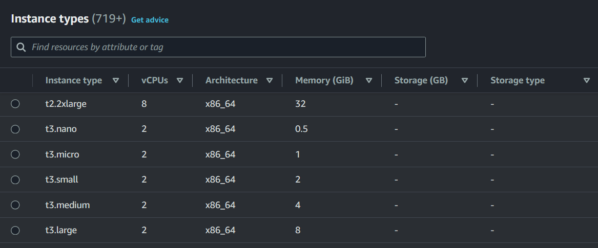</br>
3. Результат запуска</br>
   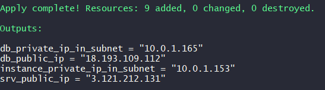</br>
   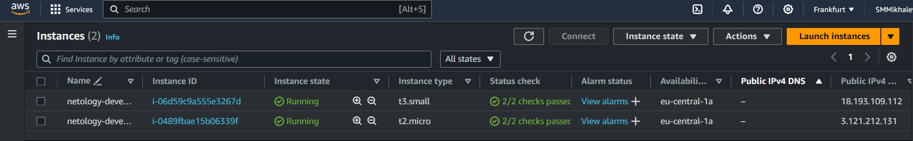</br>
4. Решаем проблему с разными зонами. К сожалению, на AWS вопрос размещения ВМ в разных зонях требует подвига. Но всегда есть достаточно простое штатное решние- использование [дефолтной VPC](https://registry.terraform.io/providers/hashicorp/aws/latest/docs/resources/default_vpc.html). Данная зона описана в файле [*av_zones.tf*](av_zones.tf) В итоге имеем красивый вариант двух машин работающих в разных зонах и даже с DNS именами:</br>
   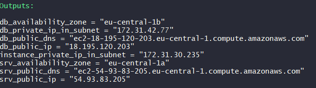</br>
5. Проверяем пинг между машинами по внутренней сети:</br>
   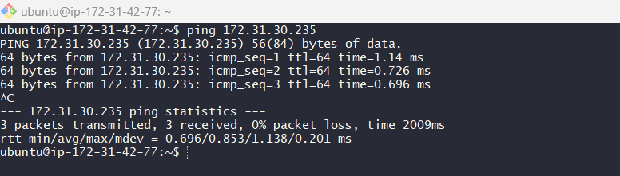</br>

-----
    
### Задание 4

1. Объявите в файле outputs.tf **один** output , содержащий: instance_name, external_ip, fqdn для каждой из ВМ в удобном лично для вас формате.(без хардкода!!!)
2. Примените изменения.

В качестве решения приложите вывод значений ip-адресов команды ```terraform output```.

---

**Решение**
1. Закомментил другие *outputs*
2. Написал новый для всех машин
3. Вывод значений команды ```terraform output```</br>
   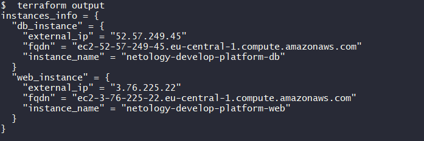</br>
   
-----

### Задание 5

1. В файле locals.tf опишите в **одном** local-блоке имя каждой ВМ, используйте интерполяцию ${..} с НЕСКОЛЬКИМИ переменными по примеру из лекции.
2. Замените переменные внутри ресурса ВМ на созданные вами local-переменные.
3. Примените изменения.

---

**Решение**
1. В файле locals.tf сделал переменную с полным описанием проека.
```
locals {
  full_project_description = "Two instatnces ${var.vm_web_name} and ${var.vm_db_name} are rized by ${var.vm_web_owner} for the project ${var.vm_web_project}."
}
```
2. Сделал для неё output
3. Вывод значений команды ```terraform output```</br>
   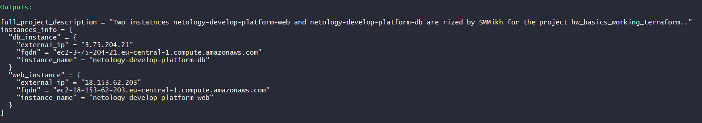</br>
   Описание проекта на странице инстанса AWS
   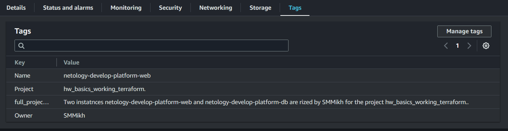</br>

-----
### Задание 6

1. Вместо использования трёх переменных  ".._cores",".._memory",".._core_fraction" в блоке  resources {...}, объедините их в единую map-переменную **vms_resources** и  внутри неё конфиги обеих ВМ в виде вложенного map(object).  
   ```
   пример из terraform.tfvars:
   vms_resources = {
     web={
       cores=2
       memory=2
       core_fraction=5
       hdd_size=10
       hdd_type="network-hdd"
       ...
     },
     db= {
       cores=2
       memory=4
       core_fraction=20
       hdd_size=10
       hdd_type="network-ssd"
       ...
     }
   }
   ```
3. Создайте и используйте отдельную map(object) переменную для блока metadata, она должна быть общая для всех ваших ВМ.
   ```
   пример из terraform.tfvars:
   metadata = {
     serial-port-enable = 1
     ssh-keys           = "ubuntu:ssh-ed25519 AAAAC..."
   }
   ```  
  
5. Найдите и закоментируйте все, более не используемые переменные проекта.
6. Проверьте terraform plan. Изменений быть не должно.

------
**Решение**
1. Создал переменную *vms_resources* с описание характеристик виртуальных машин
   ```(terrform)
   variable "vms_resources" {
      type = map(any)
      default = {
        web = {
          Platform = "Ubuntu"
          cores    = "1"
          memory   = "1G"
          hdd_size = "8G"
          hdd_type = "gp2"
        }
        db = {
          Platform = "Ubuntu"
          cores    = "2"
          memory   = "2G"
          hdd_size = "8G"
          hdd_type = "gp2"
        }
      }
    }
   ```
3. Создал переменную *metadata*
   ```(terrform)
   variable "metadata" {
      type = map(any)
      default = {
        Owner    = "SMMikh"
        Project  = "hw_basics_working_terraform."
        Platform = "Ubuntu"
      }
    }
    ```
4. Так как ранее я внёс в теги инстанса переменную *local* с описанием проекта, то решил просто смержить переменные в поле *tag*
   ```(terrform)
   tags = merge(
    var.vms_resources["web"],
    var.metadata,
    { full_project_description = local.full_project_description }
   )
   ```
5. По условиям задания я должен закоментировать все неиспользуемые теперь переменные, а именно те, что внесены в новые *map*. Однако я использую данные переменные в других ресурсах aws, включенных в проект. Например у меня есть таги в описании [*aws_security_group*](security_group.tf).
6. Я имел неосторожность использовать данные из *tags* в [output](outputs.tf) потому вывод команды *terraform plan* написал мне изменение в *Changes to Outputs*.</br>
   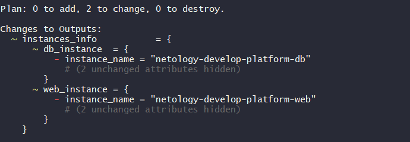</br>

-----
### Задание 7*

Изучите содержимое файла console.tf. Откройте terraform console, выполните следующие задания: 

1. Напишите, какой командой можно отобразить **второй** элемент списка test_list.
2. Найдите длину списка test_list с помощью функции length(<имя переменной>).
3. Напишите, какой командой можно отобразить значение ключа admin из map test_map.
4. Напишите interpolation-выражение, результатом которого будет: "John is admin for production server based on OS ubuntu-20-04 with X vcpu, Y ram and Z virtual disks", используйте данные из переменных test_list, test_map, servers и функцию length() для подстановки значений.

**Примечание**: если не догадаетесь как вычленить слово "admin", погуглите: "terraform get keys of map"

В качестве решения предоставьте необходимые команды и их вывод.

---

**Решение**
1. Второй элемент достаётся из переменной по ндексу
   ```length(local.test_list)```
2. Длину списка *test_list* с помощью функции *length* получаем:
   ```local.test_map["admin"]```
3. Pначение ключа admin из map test_map достаём так:
   ```local.test_map["admin"]```
4. interpolation-выражение:
   ```"${local.test_map["admin"]} is admin for production server based on OS ${local.servers.production.image} with ${local.servers.production.cpu} vcpu, ${local.servers.production.ram} ram and ${length(local.servers.production.disks)} virtual disks"```
5. Скрин вывода всех запросов к консоли</br>
   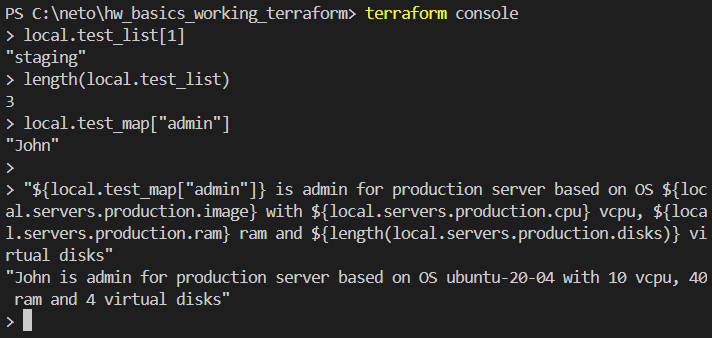</br>

-----

### Задание 8*
1. Напишите и проверьте переменную test и полное описание ее type в соответствии со значением из terraform.tfvars:
```
test = [
  {
    "dev1" = [
      "ssh -o 'StrictHostKeyChecking=no' ubuntu@62.84.124.117",
      "10.0.1.7",
    ]
  },
  {
    "dev2" = [
      "ssh -o 'StrictHostKeyChecking=no' ubuntu@84.252.140.88",
      "10.0.2.29",
    ]
  },
  {
    "prod1" = [
      "ssh -o 'StrictHostKeyChecking=no' ubuntu@51.250.2.101",
      "10.0.1.30",
    ]
  },
]
```
2. Напишите выражение в terraform console, которое позволит вычленить строку "ssh -o 'StrictHostKeyChecking=no' ubuntu@62.84.124.117" из этой переменной.

---

**Решение**
1.Создал переменную:

    ```
    variable "test" {
      type = list(map(list(string)))
      default = [
        {
          "dev1" = [
            "ssh -o 'StrictHostKeyChecking=no' ubuntu@62.84.124.117",
            "10.0.1.7",
          ]
        },
        {
          "dev2" = [
            "ssh -o 'StrictHostKeyChecking=no' ubuntu@84.252.140.88",
            "10.0.2.29",
          ]
        },
        {
          "prod1" = [
            "ssh -o 'StrictHostKeyChecking=no' ubuntu@51.250.2.101",
            "10.0.1.30",
          ]
        },
      ]
    }
    ```
    
Выражение в terraform console, которое позволит вычленить требуемую строку: ```var.test[0]["dev1"][0]</br>
   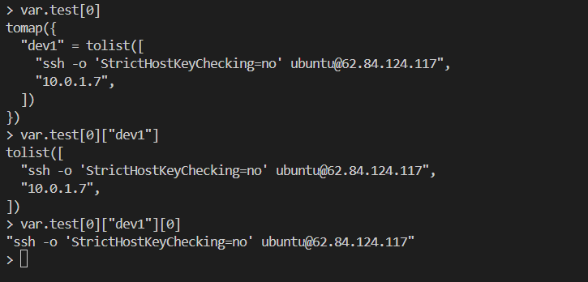</br>
